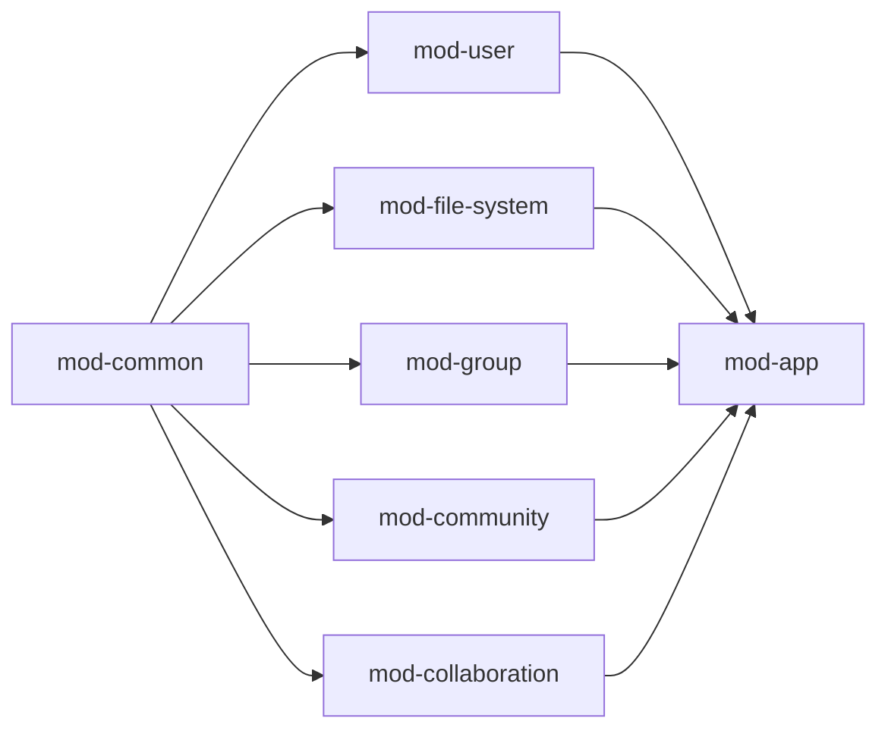
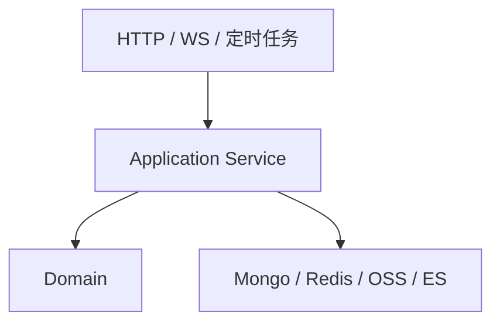
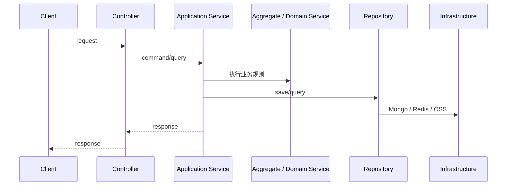
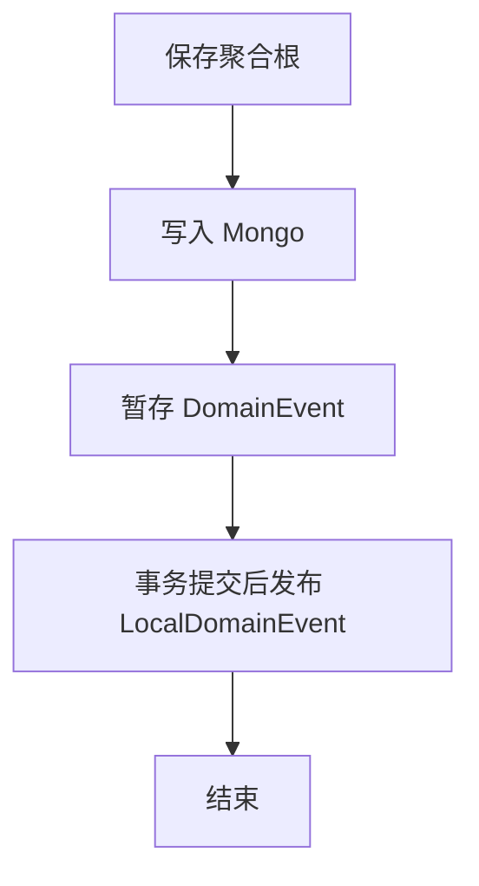

# MPCS 后端 DDD 落地实践

## 1. 范围

本文从项目架构视角说明 MPCS 后端的 DDD 落地方式，覆盖以下内容：

- 限界上下文划分
- DDD 与事件驱动、整洁架构、局部设计模式的协作关系
- `mod-common` 作为支撑域的职责
- `AggregateRoot` 与 `MongoBaseRepository` 的设计
- 当前实现的边界与演进方向

本文不讨论抽象定义本身，而讨论这些概念在当前代码库中如何落地。

---

## 2. 架构判断

MPCS 后端适合被归类为“模块化单体上的务实 DDD”。

原因很明确：

- 业务按上下文拆成独立模块，而不是只有技术分层。
- 关键业务对象以聚合根形式建模，而不是纯事务脚本。
- 基础设施层为聚合根、事件和 Mongo 持久化提供统一支撑。
- 副作用通过事件机制与主链路解耦。

这不是教科书式的纯粹 DDD 实现，但已经具备 DDD 最关键的工程特征：边界、聚合、一致性和事件出口。

---

## 3. 限界上下文

根 `pom.xml` 对应的主要模块如下：

- `mod-user`
- `mod-file-system`
- `mod-group`
- `mod-community`
- `mod-collaboration`
- `mod-common`
- `mod-app`

其中 `mod-app` 负责应用装配，`mod-common` 负责横向支撑，真正承载业务语义的是其余上下文。

### 3.1 `mod-file-system`

该上下文内部继续拆分为：

- `file`
- `folder`
- `upload`
- `fileextra`

这是典型的“一个上下文内再划分子域”的做法。文件系统上下文内部的业务并不简单，上传、目录和文件扩展信息不是一个对象可以吸收的。

### 3.2 `mod-collaboration`

协同编辑上下文内部包含：

- 协同会话
- 修订
- 编辑锁

这说明项目并不是按数据库表切模块，而是在业务复杂度较高的区域继续细分模型。

### 3.3 `mod-common`

`mod-common` 不是杂项模块。它承担的是支撑域职责：为所有业务上下文提供统一的建模基础设施和运行时约束。

---

## 4. DDD 与其他架构范式

### 4.1 与事件驱动架构

项目中的事件驱动不是独立于 DDD 的第二套体系，而是 DDD 的外延机制。

- DDD 负责定义业务事实
- EDA 负责传播和消费这些事实

因此，事件不是技术消息，而是领域消息。

### 4.2 与整洁架构

系统依赖方向大体符合整洁架构原则：

- 接口层负责协议适配
- 应用层负责用例编排
- 领域层负责业务规则
- 基础设施层负责存储、消息、缓存和外部系统接入

这套分层不是为了形式上的“层”，而是为了让依赖方向长期可控。

### 4.3 与局部设计模式

局部设计模式在本项目里承担的是技术组织作用，而不是业务建模作用。

| 模式 | 代码体现 | 用途 |
| --- | --- | --- |
| Factory | `FileFactory`、`UploadSessionFactory` | 收敛复杂创建逻辑 |
| Repository | 各 Mongo Repository | 隔离持久化 |
| Template Method | `MongoBaseRepository` | 统一保存聚合与托管事件 |
| Strategy | `StorageService`、哈希与提取器工厂 | 屏蔽可替换实现 |
| Event/Observer | `DomainEvent`、`LocalDomainEvent` | 解耦副作用 |

模式解决局部问题，DDD 解决整体边界和模型问题。两者不冲突，也不互相替代。

---

## 5. 典型分层路径

这条路径中，最重要的约束是职责边界：

- Controller 不持有业务规则
- Application Service 不持有聚合状态
- Repository 不负责定义业务事实
- Domain 不直接依赖具体外部系统

---

## 6. `mod-common` 作为支撑域

### 6.1 作用

`mod-common` 提供的是跨上下文稳定能力，而不是通用工具集。

其核心内容包括：

- `domain`
- `event`
- `mongo`
- `validation`
- `exception`

这些内容共同解决一个问题：不同业务上下文如何在同一套工程约束下建模和运行。

### 6.2 价值

如果没有 `mod-common`，各业务模块会各自实现以下内容：

- 聚合根基类
- 事件暂存与发布
- Mongo Repository 模板
- 资源归属校验
- 审计字段
- 校验与异常规范

结果通常是语义漂移和重复实现。  
`mod-common` 的存在，避免了这种分裂。

---

## 7. `AggregateRoot`

文件：`mod-common/src/main/java/com/ricky/common/domain/AggregateRoot.java`

### 7.1 角色

`AggregateRoot` 不是普通父类。它定义了项目中“聚合根”必须具备的最小能力：

- 统一标识
- 审计字段
- 操作日志
- 领域事件
- 本地领域事件
- 乐观锁版本

### 7.2 设计价值

#### 统一身份与审计

所有聚合根默认具备：

- `id`
- `userId`
- `createdAt`
- `createdBy`
- `updatedAt`
- `updatedBy`

这使资源归属、审计追踪和并发控制不再是各模块自选项。

#### 统一事件出口

通过 `raiseEvent(...)` 和 `raiseLocalEvent(...)`，聚合根天然具备事件能力。  
这意味着“领域事实的对外表达”不是后加逻辑，而是聚合模型的组成部分。

#### 统一并发控制

`@Version` 让 Mongo 文档上的乐观锁成为默认能力，尤其适合协同编辑、上传状态推进这类并发修改场景。

#### 统一行为轨迹

`opsLogs` 为聚合行为保留最轻量的业务轨迹。它不是完整审计系统，但足够支撑大部分领域操作回溯需求。

### 7.3 架构意义

`AggregateRoot` 的真正价值不在于减少重复代码，而在于把“什么才算聚合根”沉成统一约束。

---

## 8. `MongoBaseRepository`

文件：`mod-common/src/main/java/com/ricky/common/mongo/MongoBaseRepository.java`

### 8.1 角色

`MongoBaseRepository` 是项目对 MongoDB 的 DDD 适配层。  
它不是 DAO 基类，而是 Repository 模板，统一托管以下职责：

- 聚合根持久化
- 批量保存与删除
- 查询语义约束
- 用户归属检查
- 分布式事件暂存
- 本地事件事务后发布

### 8.2 设计要点

#### 统一查询语义

该基类不是简单提供 `findById`。它显式区分：

- `byId`
- `byIdOptional`
- `byIdAndCheckUserShip`
- `byIdsAll`

这些方法名本身就编码了资源查询语义和访问边界。

#### 统一保存模板

保存聚合根时，Repository 执行的是固定模板：

这相当于为 Mongo 文档模型补齐了 DDD Repository 所需的事件接力能力。

#### 统一资源归属校验

`checkUserShip(...)` 将资源所有权校验下沉到 Repository 基类，避免业务模块重复实现相同逻辑。

### 8.3 架构意义

Mongo 官方生态并不会直接提供一套适合聚合根、事件 outbox 和资源归属语义的 Repository 实现。  
`MongoBaseRepository` 的价值在于，它把这些能力一次性补齐，并作为平台能力复用到各上下文。

---

## 9. 事件机制在 DDD 落地中的位置

项目的事件机制不是附加能力，而是 DDD 落地的重要组成部分：

- 聚合根内声明事实
- Repository 托管事件
- 基础设施负责传播
- 处理器负责副作用

这一套机制的直接效果是：

- 主链路更短
- 副作用更清晰
- 模块扩展更可控

这也是为什么 `mod-common.event` 和 `mod-common.mongo` 必须放在同一层面理解：前者提供事实出口，后者提供状态落地与事件接力。

---

## 10. 落地方法

### 10.1 先划边界，再写代码

在当前项目中，正确顺序应当是：

1. 确认能力属于哪个上下文
2. 确认聚合根是谁
3. 确认哪些状态必须在一个一致性边界内维护
4. 再设计应用服务和接口

反过来做，很容易退化成表驱动的事务脚本。

### 10.2 先区分过程对象和结果对象

例如：

- 上传过程是 `UploadSession`
- 业务结果是 `File`

这是项目中很好的实践，应继续沿用到其他复杂流程。

### 10.3 副作用不进入主事务

以下动作都应优先考虑事件化：

- 上传完成后的派生处理
- 删除后的外部同步
- 协同状态广播
- 模块间通知

主链路只负责形成正确业务事实。

### 10.4 基础设施做成平台能力

`AggregateRoot`、`MongoBaseRepository`、事件体系这些能力一旦散落到各模块私有实现中，DDD 就会迅速退化。  
当前项目最可贵的地方，是已经把这些能力沉到了统一平台层。

---

## 11. 当前约束

当前架构的边界需要明确：

- `mod-common` 能力较强，必须持续控制边界，避免演化成无边界公共模块。
- Repository 基类已经承担较多职责，后续新增能力时必须避免继续吞并业务逻辑。
- 事件机制具备工程实用性，但仍缺少更强的运行期可观测能力。

这些都不是结构错误，但如果不加约束，后续会削弱当前架构的清晰度。

---

## 12. 演进建议

后续演进建议保持在现有边界内推进，而不是推翻当前架构：

1. 为关键上下文补充 ADR，明确边界与关键决策。
2. 加强聚合根不变量测试和并发测试。
3. 建立事件链路的监控、告警和补偿手段。
4. 持续收敛 `mod-common` 的职责范围，只保留跨上下文稳定能力。
5. 若未来拆分服务，优先沿当前限界上下文演进，而不是按技术层拆分。

---

## 13. 结论

MPCS 后端的 DDD 落地并不追求理论纯度，而是追求长期可维护的工程结构。  
其核心资产不是概念，而是已经沉淀下来的统一基础设施：

- 以模块表达上下文
- 以聚合根表达一致性边界
- 以 `AggregateRoot` 统一聚合能力
- 以 `MongoBaseRepository` 适配 Mongo 文档模型
- 以双轨事件机制承接副作用

这套结构已经足以支撑系统继续演进，前提是后续变更继续遵守这些边界。
