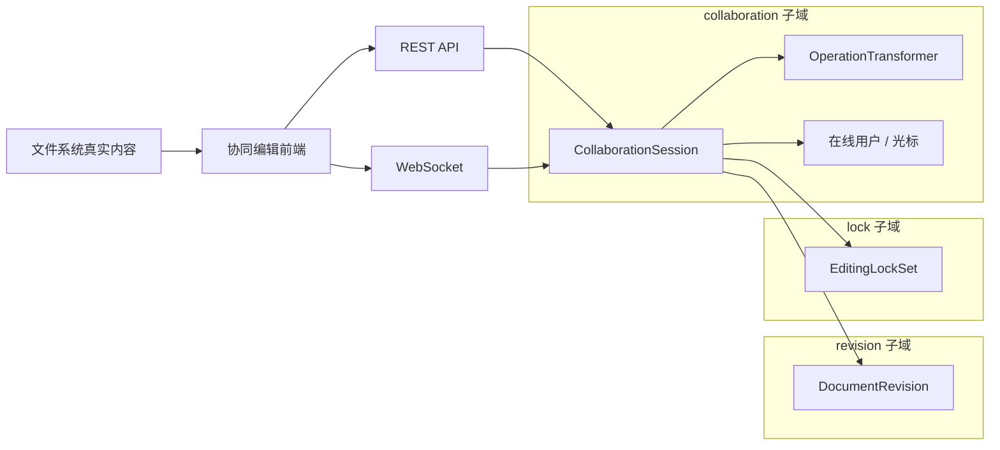
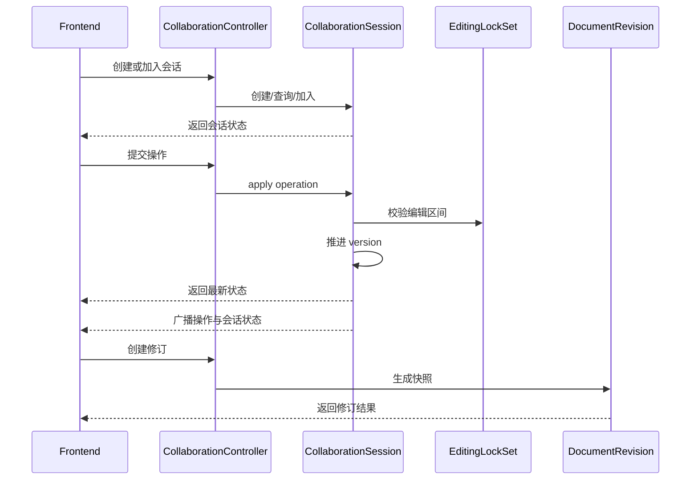

# 协同编辑领域设计

## 1. 范围

本文说明协同编辑上下文的边界、模型和运行链路，覆盖：

- `mod-collaboration`
- 前端协同编辑接入方式
- 会话、修订、编辑锁三个子域
- REST 与 WebSocket 的职责分工
- OT、版本推进和状态广播

协同编辑是系统中并发语义最强的区域，因此文档重点关注一致性边界和运行时约束，而不是接口清单本身。

---

## 2. 上下文拆分

协同编辑上下文内部不是单一聚合，而是三个并列子域：

1. `collaboration`
2. `revision`
3. `lock`

对应三个聚合根：

- `CollaborationSession`
- `DocumentRevision`
- `EditingLockSet`

这个拆分是必要的。  
会话状态、修订快照和编辑锁都围绕同一份文档工作，但它们的生命周期和一致性要求并不相同，不应强行压进同一个聚合。

---

## 3. 子域职责

### 3.1 `CollaborationSession`

`CollaborationSession` 负责：

- 会话生命周期
- 当前逻辑版本 `version`
- 已持久化基线版本 `baseVersion`
- 增量操作历史
- 在线用户列表
- 光标与选区状态

它是实时协作的主聚合。

### 3.2 `DocumentRevision`

`DocumentRevision` 负责：

- 文档快照
- 修订序号
- 版本区间
- 修订时间
- 变更摘要

它承担的是可回看、可比较的版本语义，不承担实时会话状态。

### 3.3 `EditingLockSet`

`EditingLockSet` 负责：

- 编辑区间锁
- 冲突检测
- TTL 管理
- 操作变换后的锁区间漂移

它不是文档权限系统，而是编辑期局部冲突控制机制。

---

## 4. 版本模型

协同编辑中存在两个版本：

- `version`
- `baseVersion`

### 4.1 `version`

`version` 表示当前会话已经接收并应用的逻辑操作版本。  
每成功接纳一条操作，`version` 推进一次。

### 4.2 `baseVersion`

`baseVersion` 表示底层文件系统内容已经吸收到了哪个协同版本。  
换言之，文件系统中的内容快照只覆盖到 `baseVersion`，其后的内容需要通过操作历史回放补齐。

这种设计解决的是“实时会话内容”和“持久化文件内容”之间的差异管理问题。

---

## 5. 运行链路

### 5.1 会话链路

### 5.2 REST 与 WebSocket 分工

职责划分如下：

- REST：命令提交、查询、会话管理、修订管理、编辑锁管理
- WebSocket：状态广播、实时同步、在线态传播

REST 负责形成状态，WebSocket 负责分发状态。  
两者不共享职责，也不互相替代。

---

## 6. OT 与操作历史

协同编辑的实时一致性建立在两层机制之上：

1. 操作历史按版本顺序保存
2. 新操作进入时按客户端版本进行变换

因此，系统能同时支持：

- 同步在线协作
- 断线后按 `fromVersion` 拉取增量历史
- 基于 `baseVersion` 回放会话内容

这也是为什么操作历史必须属于 `CollaborationSession` 聚合，而不是临时缓存。

---

## 7. 编辑锁

编辑锁采用会话内局部区间锁，而不是全局文档锁。  
这使系统可以在“允许多人同时编辑”和“避免局部冲突”之间取得平衡。

### 7.1 规则

- 同一用户在同一会话内只保留一个活动锁
- 锁带 TTL，需要续租
- 支持零长度锁和区间锁
- 用户离开会话时释放该用户的全部锁

### 7.2 与 OT 的协同

锁并不是静态区间。  
当文本插入或删除后，锁区间需要按操作结果进行位置变换，否则锁将脱离真实文档结构。

因此，`EditingLockSet` 不只是校验器，也是一个随文档变化而演化的聚合。

---

## 8. 修订

修订模型采用快照而不是 patch。  
原因很明确：

- 查询成本低
- 恢复简单
- diff 可在查询时计算

当前设计中，修订是面向用户理解的版本语义，而不是底层 OT 历史的镜像。  
因此修订号、变更摘要、来源类型都应该独立于实时会话版本存在。

---

## 9. 设计约束

当前协同上下文有几个重要边界：

- 文件系统内容不是实时协同内容本身，两者通过 `baseVersion` 关联。
- 修订聚合不维护实时光标、在线用户或锁状态。
- 编辑锁仅服务于编辑冲突控制，不承担权限控制职责。
- WebSocket 负责传播，不负责形成权威状态。

如果打破这些边界，系统很快会出现职责交叉和状态源混乱。

---

## 10. 结论

协同编辑上下文的关键不在于接口多少，而在于状态拆分是否正确。  
当前设计将协同会话、修订和编辑锁拆成三个聚合根，是合理且必要的：

- `CollaborationSession` 管实时状态
- `DocumentRevision` 管历史快照
- `EditingLockSet` 管局部冲突

这使系统能够在一个上下文内同时处理实时同步、历史追踪和局部并发控制，而不把所有复杂度压进单一模型。
