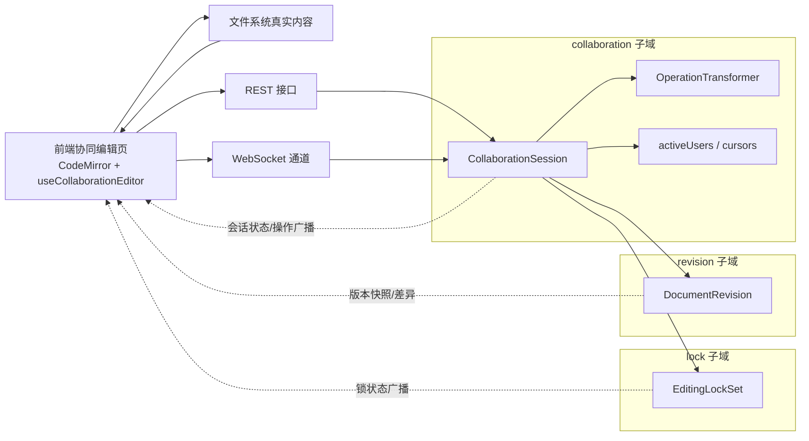
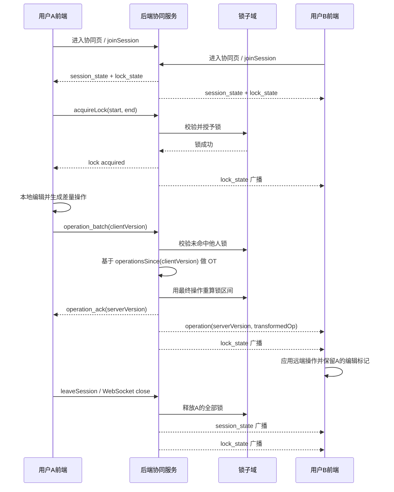

# 协同编辑领域设计

## 1. 文档目标

本文档说明当前 `mpcs-backend` 与 `mpcs-frontend` 协同编辑模块的最新设计与实现，覆盖以下内容：

- 领域边界与 DDD 包划分
- 协同会话、文档版本、编辑锁三个子域的职责
- REST 与 WebSocket 接口
- OT 算法与并发编辑收敛逻辑
- 前端协同编辑器实现方式
- 多用户同时编辑时的实时同步机制
- 当前测试覆盖与已知约束

适用代码范围：

- 后端：`mod-collaboration`
- 前端：`F:\Develop\java\mpcs\mpcs-frontend\src`

---

## 2. 总体设计

当前协同编辑模块不是单一聚合，而是由三个并列子域组成：

1. `collaboration` 子域
2. `revision` 子域
3. `lock` 子域

每个子域各自只有一个聚合根，符合项目中按业务子域建模、每个子域一个聚合根的约束。

### 2.0 总体架构图



### 2.1 子域划分

#### collaboration 子域

聚合根：`CollaborationSession`

职责：

- 管理协同会话生命周期
- 维护当前文档逻辑版本 `version`
- 维护已保存基线版本 `baseVersion`
- 保存增量操作历史 `operationHistory`
- 维护在线用户 `activeUsers`
- 维护光标与选区 `cursors`

#### revision 子域

聚合根：`DocumentRevision`

职责：

- 管理文档版本记录
- 保存可回溯的内容快照
- 支持版本列表、详情、差异对比
- 为前端提供直观的版本管理视图

#### lock 子域

聚合根：`EditingLockSet`

职责：

- 管理当前会话内的编辑区间锁
- 校验编辑冲突
- 锁定区间随 OT 操作漂移
- 用户离开时释放该用户全部锁

### 2.2 模块关系

```text
文件系统真实内容
    ^
    | 保存 / 读取
    |
前端协同编辑器  <------>  collaboration 子域
                        |-- OT 变换
                        |-- 在线用户
                        |-- 操作历史
                        |
                        |------> lock 子域
                        |         |-- 编辑区间锁
                        |         |-- 冲突校验
                        |
                        |------> revision 子域
                                  |-- 版本快照
                                  |-- diff 查询
```

---

## 3. 领域模型

## 3.1 CollaborationSession

核心字段：

- `id`：协同会话 ID
- `documentId`：文档 ID
- `documentTitle`：文档标题
- `parentFolderId`：所属目录
- `version`：当前协同逻辑版本
- `baseVersion`：最近一次保存到文件系统时对应的协同版本
- `operationHistory`：操作历史
- `activeUsers`：在线用户
- `cursors`：用户光标与选区
- `expiresAt`：会话过期时间

关键语义：

- `version` 每成功接收一条操作就推进
- `baseVersion` 表示文件系统内容已经包含了多少条协同操作
- 当前可见文档内容 = 文件系统内容 + `baseVersion` 之后的增量操作回放

## 3.2 DocumentRevision

核心字段：

- `sessionId`
- `documentId`
- `documentTitle`
- `revisionNo`
- `baseVersion`
- `contentSnapshot`
- `changeSummary`
- `source`
- `fromVersion`
- `toVersion`
- `revisionAt`

设计原则：

- 版本记录面向“用户可理解的历史”
- 存全文快照，不存复杂 patch
- diff 在查询阶段动态计算

`source` 当前支持：

- `MANUAL_SAVE`
- 预留自动保存与恢复扩展能力

## 3.3 EditingLockSet

核心字段：

- `sessionId`
- `documentId`
- `locks`

锁模型说明：

- 一个用户在同一会话下只保留一个活动锁区间
- 锁有 TTL，当前默认 15 秒
- 客户端通过续租维持锁存活
- 用户离开会话时释放该用户全部锁

锁的语义：

- 锁既可以是区间锁，也可以是零长度锁
- 零长度锁表示“某用户当前停留在该位置编辑”
- 区间锁表示“某用户正在编辑该段区域”

---

## 4. 版本模型

## 4.1 `version`

`version` 是协同会话的逻辑版本。

示例：

- 初始：`version = 0`
- 第 1 条操作后：`version = 1`
- 第 2 条操作后：`version = 2`

## 4.2 `baseVersion`

`baseVersion` 是文件系统已吸收的协同版本。

典型流程：

1. 用户持续协同编辑，`version` 不断递增
2. 用户保存文件到文件系统
3. 保存成功后，将当前 `version` 写入 `baseVersion`

之后重新进入协同页时：

1. 先读取文件系统内容
2. 再读取 `fromVersion = baseVersion` 之后的操作历史
3. 回放增量操作得到最新内容

这避免了已保存历史被重复回放。

---

## 5. 接口设计

## 5.1 协同会话接口

控制器：`CollaborationController`

### 创建会话

`POST /collaboration/sessions`

作用：

- 为文档创建协同会话
- 若同文档已有会话，则返回已有会话

### 查询会话

`GET /collaboration/sessions/{sessionId}`

返回：

- 会话元信息
- 当前版本
- 已保存基线版本
- 在线用户
- 光标信息

### 按文档查询会话

`GET /collaboration/sessions/document/{documentId}`

### 加入会话

`POST /collaboration/sessions/{sessionId}/join`

### 离开会话

`POST /collaboration/sessions/{sessionId}/leave`

离开时除了移出在线用户，还会触发：

- 释放该用户全部编辑锁
- 广播最新 `session_state`
- 广播最新 `lock_state`

### 获取操作历史

`GET /collaboration/sessions/{sessionId}/history?fromVersion={n}`

作用：

- 获取指定版本之后的增量操作

### 更新 baseVersion

`PUT /collaboration/sessions/{sessionId}/base-version?baseVersion={n}`

作用：

- 文件保存成功后，将已保存基线推进到最新版本

## 5.2 文档版本接口

控制器：`DocumentRevisionController`

路径前缀：

`/collaboration/documents/{documentId}/revisions`

### 创建版本

`POST /collaboration/documents/{documentId}/revisions`

### 查询版本列表

`GET /collaboration/documents/{documentId}/revisions`

### 查询版本详情

`GET /collaboration/documents/{documentId}/revisions/{revisionId}`

### 查询版本差异

`GET /collaboration/documents/{documentId}/revisions/{revisionId}/diff?compareToRevisionId=...`

## 5.3 编辑锁接口

控制器：`EditingLockController`

### 获取锁状态

`GET /collaboration/sessions/{sessionId}/locks`

### 获取锁

`POST /collaboration/sessions/{sessionId}/locks`

### 续租锁

`POST /collaboration/sessions/{sessionId}/locks/{lockId}/renew`

### 释放锁

`DELETE /collaboration/sessions/{sessionId}/locks/{lockId}`

---

## 6. WebSocket 设计

入口：

`/api/v1.0/ws/collaboration/{sessionId}?userId=...&username=...`

处理器：

- `CollaborationWebSocketHandler`

## 6.1 连接建立后的初始化消息

服务端在连接成功后会主动发送：

1. `session_state`
2. `lock_state`

这样前端在 WebSocket 建立后即可拿到：

- 当前在线成员
- 当前版本号
- 当前编辑锁分布

## 6.2 核心消息类型

### `operation`

单条远端操作广播。

注意：

- 广播的是 OT 变换后的最终操作
- 不是客户端原始提交的操作

### `operation_batch`

客户端本地编辑经过压缩后，批量提交给服务端。

### `operation_ack`

服务端返回给提交方的确认消息。

关键字段：

- `serverVersion`
- `success`

### `session_state`

广播会话状态变化，尤其用于：

- 新用户加入
- 用户离开
- 在线人数同步

### `lock_state`

广播当前全部活动锁。

用于：

- 远端编辑区域高亮
- 用户名标记展示
- 锁释放后的 UI 回收

---

## 7. OT 算法

## 7.1 为什么需要 OT

协同编辑的核心问题不是“广播内容”，而是“并发操作如何收敛”。

若两个用户同时基于同一旧版本编辑：

- 用户 A 在位置 0 插入 `A`
- 用户 B 在位置 0 插入 `B`

如果不做 OT，最终不同客户端可能得到不同结果。

OT 的目标是：

- 把晚到的操作变换到服务端当前版本坐标系
- 确保服务端与所有客户端收敛到同一结果

## 7.2 当前 OT 输入模型

文本操作类型：

- `INSERT`
- `DELETE`
- `RETAIN`

核心字段：

- `position`
- `content`
- `length`
- `userId`
- `clientVersion`

其中最关键的是 `clientVersion`。

它表示：

- 客户端生成该操作时，所基于的服务端版本

## 7.3 服务端变换原则

服务端只会对客户端未见过的并发操作做 transform。

即：

- 若客户端操作的 `clientVersion = 10`
- 服务端当前 `version = 12`
- 则仅对版本 `10` 之后的服务端历史做 OT 变换

不能再像错误实现那样对“最近 100 条操作”全部做 transform，否则会重复变换客户端已见历史，导致位置漂移和乱码。

## 7.4 当前支持的基础变换

- `INSERT vs INSERT`
- `INSERT vs DELETE`
- `DELETE vs INSERT`
- `DELETE vs DELETE`

关键规则：

- 同位置插入时，用稳定规则决定顺序
- 删除操作与远端插入/删除重叠时，需要重算起点与长度
- 批量操作时，每一条操作都必须基于其各自的 `clientVersion` 单独计算并发历史

## 7.5 锁与 OT 的关系

编辑锁不是 OT 的替代，而是 OT 之前的并发约束。

服务端处理顺序是：

1. 校验操作是否命中他人锁区间
2. 若冲突，拒绝该操作
3. 若允许，按 `clientVersion` 获取并发历史
4. 做 OT 变换
5. 写入会话历史
6. 用最终操作重算其他用户锁区间
7. 广播操作与最新锁状态

这保证：

- 锁语义稳定
- 锁位置随文档变化移动
- 远端看到的锁区间不会漂移到错误位置

---

## 8. 前端实现

## 8.1 核心状态管理

核心 Hook：

- `useCollaborationEditor`

核心职责：

- 初始化会话
- 拉取文件内容与操作历史
- 建立 WebSocket
- 管理本地内容
- 管理 `pendingOps` 与 `inFlightOps`
- 处理 `operation_ack`、`operation`、`session_state`、`lock_state`
- 暴露锁的获取、续租、释放能力

## 8.2 编辑器实现

当前前端已从普通 `TextArea` 升级为 CodeMirror 6。

组件：

- `CollaborativeCodeMirror.tsx`

当前实现能力：

- Markdown 编辑
- 远端编辑区间高亮
- 远端用户名标记
- 零宽锚点显示远端光标位置
- 本地输入前拦截被锁区间

重要约束：

- 远端标记必须是覆盖式装饰
- 不能改变正文文本结构
- 不能用额外换行或插入真实字符来表达“有人正在编辑”

## 8.3 本地操作生成

前端不会上传整篇文档，而是将一次编辑压缩成最小差量操作。

当前策略：

- 比较旧内容与新内容
- 折叠为少量 `INSERT` / `DELETE`
- 加入 `pendingOps`
- 通过 WebSocket 批量发送

## 8.4 未确认操作队列

前端维护两类未确认操作：

- `pendingOps`：尚未发送
- `inFlightOps`：已发送，等待 ack

这样做的原因是：

- 本地输入可立即更新 UI
- 收到远端操作时，可将远端操作与本地未确认操作做 rebase
- 避免远端更新覆盖本地尚未确认编辑

## 8.5 锁的前端语义

当前实现已修正为以下行为：

- 用户自己不显示“我正在编辑”的提示标签
- 其他用户才能看到该用户的编辑位置和用户名
- 锁冲突不再用高频严重错误提示
- 冲突仅表现为低打扰警告，同时文中对应位置持续显示远端用户标记
- 锁不会在单纯失焦时立刻消失
- 锁会在以下场景释放：
    - 切换到新的编辑区域
    - 保存成功
    - 离开协同页
    - TTL 到期且未续租

这保证了旁观者在不刷新的情况下，仍能持续看到“谁正在编辑哪里”。

---

## 9. 两个用户同时编辑时的实时链路

以用户 A、B 同时编辑同一文档为例。

### 9.0 双用户实时协同时序图



## 9.1 初始化

1. A、B 进入协同页
2. 前端根据文档 ID 获取或创建会话
3. 前端加入会话
4. 前端读取文件系统内容
5. 前端读取 `baseVersion` 之后的操作历史并回放
6. 前端建立 WebSocket
7. 服务端返回 `session_state` 和 `lock_state`

## 9.2 用户 A 编辑

1. A 在某个位置开始编辑，前端申请锁
2. 服务端校验无冲突后授予锁
3. 服务端广播最新 `lock_state`
4. B 页面立即看到 A 的用户名标签和锁定区域
5. A 输入内容，本地立即更新
6. A 将差量操作通过 WebSocket 提交

## 9.3 服务端处理 A 的操作

1. 校验 A 仍在会话中
2. 校验 A 的操作未命中其他用户锁
3. 获取 `clientVersion` 之后的并发历史
4. 做 OT 变换
5. 将最终操作写入 `CollaborationSession`
6. 重算其他用户锁区间
7. 广播 `operation`
8. 广播最新 `lock_state`
9. 向 A 返回 `operation_ack`

## 9.4 用户 B 收到更新

1. B 收到远端 `operation`
2. 将该操作与自己的本地未确认操作做 rebase
3. 更新本地文档内容
4. 保留或更新远端锁标记

最终效果：

- A 立即看到自己的输入
- B 几乎实时看到 A 的文本变化
- B 同时能看到 A 正在编辑的区域
- 若 B 尝试编辑被 A 锁定的区域，会被拦截并给出轻量警告

## 9.5 用户离开

当 A 退出协同编辑时：

1. 前端离开页面
2. 服务端处理 `leaveSession`
3. 清理 A 的在线状态
4. 清理 A 的全部编辑锁
5. 广播新的 `session_state`
6. 广播新的 `lock_state`

因此 B 无需刷新页面，就会看到：

- 右上角在线人数减少
- A 的用户名头像消失
- A 的编辑区域标记消失

---

## 10. 文档版本管理

版本管理不是简单复用字符级 `operationHistory`，而是单独建模。

原因：

- `operationHistory` 粒度太细，适合实时协同，不适合用户阅读
- 版本管理需要稳定快照、差异对比和时间线展示

当前版本管理设计：

- 保存文件成功后，前端调用创建版本接口
- 后端创建 `DocumentRevision`
- 前端侧边栏展示版本时间线
- 右侧展示版本详情、统计信息和可视化 diff

当前前端版本视图优化点：

- 左侧版本列表与右侧详情区独立滚动
- 版本列表按时间线卡片展示
- 右侧使用左右对照 diff，而不是原始 unified diff 文本直出

---

## 11. 测试策略

## 11.1 单元测试

重点覆盖：

- OT 基础变换正确性
- 锁冲突校验
- 锁随操作漂移
- 用户离开时释放全部锁

代表测试：

- `OperationTransformerTest`
- `EditingLockSetTest`

## 11.2 接口测试

重点覆盖：

- 会话创建、加入、离开
- 仅对并发历史做 transform
- 同基线并发插入的收敛性
- 版本创建与差异查询
- 锁获取、冲突、释放、离开会话时释放锁

代表测试：

- `CollaborationControllerTest`

---

## 12. 当前已解决的关键问题

本轮实现已明确修复以下问题：

- 服务端错误地对已见历史重复做 OT 变换
- 服务端广播原始操作而非变换后操作
- 前端未处理远端 `operation`
- 前端早期粗糙 diff 导致操作洪泛
- 锁接口路径参数与请求体验证不一致
- CodeMirror 远端装饰排序错误导致运行时崩溃
- 锁重复释放导致 Mongo 写冲突被放大
- 用户离开后在线人数不减少
- 用户离开后远端锁标记不消失
- 锁冲突提示过重、重复弹出

---

## 13. 约束与后续演进

当前设计已可支撑多人实时文本协同，但仍有演进空间：

- 支持同用户多活动锁区间
- 增加自动保存版本
- 支持版本恢复
- 增加更完整的 WebSocket 集成测试
- 对超长 `operationHistory` 做快照压缩
- 增强光标存在感展示与多用户颜色体系

---

## 14. 总结

当前协同编辑模块的核心不是“同步整段文本”，而是：

- 用 `CollaborationSession` 管理会话与版本
- 用 OT 保证并发操作收敛
- 用 `EditingLockSet` 约束并发编辑区间
- 用 `DocumentRevision` 提供可读的版本管理
- 用 WebSocket 保持实时状态同步
- 用 CodeMirror 以不破坏正文结构的方式展示远端编辑状态

这套设计已经形成完整闭环：

- 可实时协同
- 可查看版本历史
- 可感知他人编辑位置
- 可阻止锁冲突编辑
- 可在用户离开时自动收敛在线状态与锁状态
