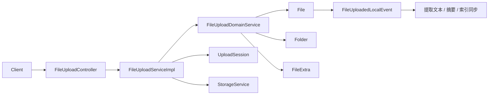
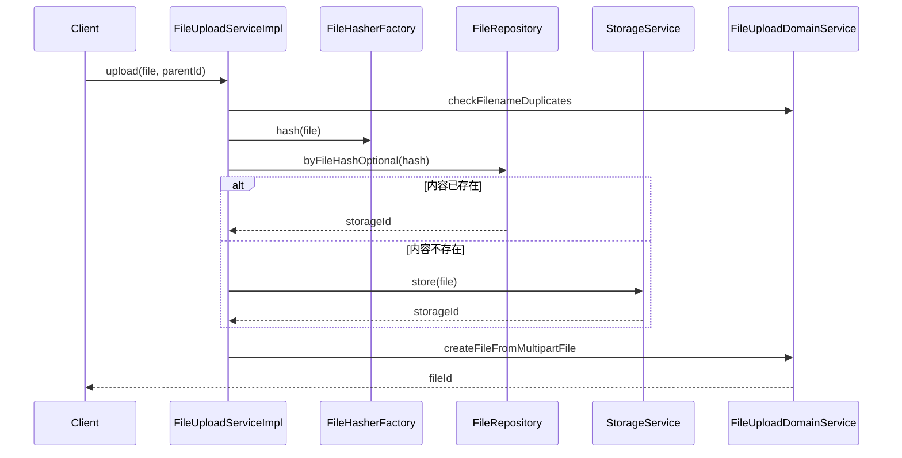
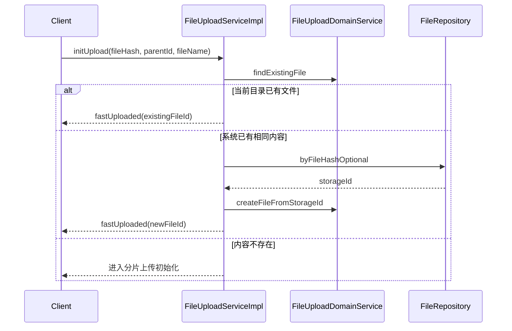
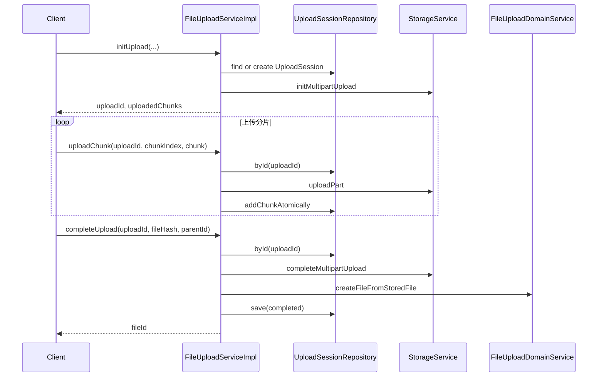
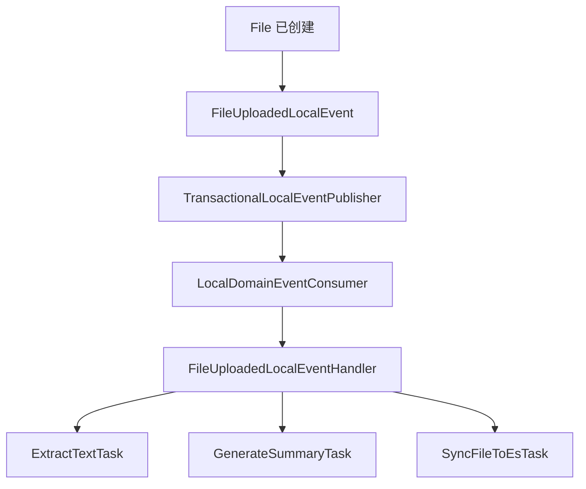

# 文件上传设计

## 1. 范围

本文说明 `mod-file-system` 中上传子域的设计，覆盖以下实现：

- `FileUploadController`
- `FileUploadServiceImpl`
- `UploadSession`
- `FileUploadDomainService`
- `StorageService` 及 OSS 实现

文档关注的不是接口清单本身，而是上传子域如何与文件子域协作，以及普通上传、分片上传、秒传如何收敛到同一套领域模型。

---

## 2. 设计判断

上传不是文件领域本身，而是文件创建过程的一部分。  
因此系统将“上传过程”与“文件结果”拆成两个对象：

- `UploadSession`：建模上传过程
- `File`：建模最终文件实体

这个拆分是必要的。否则，分片状态、断点续传、哈希校验、合并过程都会污染 `File` 聚合根，最终导致文件领域同时承担过程状态与业务结果两类职责。

---

## 3. 结构

结构上有两个收口：

1. 内容最终由 `StorageService` 接管。
2. 文件实体最终由 `FileUploadDomainService` 统一创建。

因此三类入口路径虽然不同，但不会演化出三套文件落库逻辑。

---

## 4. 接口

控制器路径：`/files/upload`

| 接口 | 作用 |
| --- | --- |
| `POST /files/upload` | 普通上传 |
| `POST /files/upload/init` | 初始化上传；若可秒传则直接返回结果 |
| `POST /files/upload/chunk` | 上传单个分片 |
| `POST /files/upload/complete` | 完成上传并创建文件 |
| `POST /files/upload/compute-hash` | 计算文件哈希 |

其中 `completeUpload` 是统一收口点。无论前面走的是分片路径还是秒传路径，文件实体都在这里进入最终创建阶段。

---

## 5. 核心对象

### 5.1 `UploadSession`

`UploadSession` 是上传子域的聚合根，维护上传过程的完整状态：

- 上传归属人
- 文件名
- 预期哈希
- 总大小
- 分片大小
- 分片总数
- OSS `uploadId`
- 上传状态
- 已上传分片集合

它的职责非常明确：

- 校验上传归属
- 记录分片进度
- 校验分片完整性
- 校验最终哈希
- 标记上传完成

它不负责创建 `File`，也不负责目录挂载。

### 5.2 `File`

`File` 是结果对象。上传流程的最终目的不是维护 `UploadSession`，而是生成 `File` 聚合根，并将其挂接到 `Folder`，同时创建 `FileExtra`。

`File` 创建时会触发 `FileUploadedLocalEvent`。这意味着上传完成之后的派生动作依附于文件创建事实，而不是依附于控制器动作。

### 5.3 `FileUploadDomainService`

`FileUploadDomainService` 负责处理上传与文件领域之间的衔接工作：

- 校验同目录文件名冲突
- 判断当前目录是否已经存在相同文件
- 通过 `FileFactory` 统一创建 `File`
- 将文件挂载到目录
- 创建 `FileExtra`

应用服务不直接拼装文件对象，也不自己维护目录关系。

---

## 6. 普通上传

### 6.1 流程

### 6.2 设计重点

普通上传不是“直接存文件然后落表”这么简单。系统先判断内容是否已存在，再决定是否需要再次写入底层存储。

这里有一个关键建模判断：

- 内容对象是否存在
- 文件记录是否存在

这是两个不同问题。  
即使底层内容已经存在，当前目录下仍然可能需要新建一条 `File` 记录。这也是上传设计能支撑内容去重的前提。

---

## 7. 秒传

### 7.1 语义

秒传优化的是传输，不是建模。  
系统并不会因为秒传而绕开文件领域；它只是避免重复上传二进制内容。

### 7.2 判定顺序

`initUpload` 中有两层判定：

1. 当前目录是否已经存在同名同哈希的文件
2. 系统中是否已经存在同哈希内容

两层判定对应不同处理：

- 若当前目录已有相同文件，直接返回已有结果，不再创建新文件。
- 若系统已有相同内容但当前目录无该文件，则复用 `storageId`，创建新的 `File`。

### 7.3 流程

这里最重要的结论是：秒传不是绕过领域模型，而是绕过内容传输。

---

## 8. 分片上传

### 8.1 初始化

初始化阶段承担三项职责：

- 校验文件名冲突
- 查询当前用户是否已有同哈希上传会话
- 如无会话则创建 `UploadSession` 并初始化 OSS multipart upload

返回值包含：

- `uploadId`
- `uploadedChunks`

因此前端可以基于已有进度继续上传，而不需要重新开始。

### 8.2 分片写入

单个分片上传时，服务端执行以下步骤：

1. 按 `uploadId` 读取 `UploadSession`
2. 校验所有权
3. 校验会话未完成
4. 调用 `storageService.uploadPart(...)`
5. 原子写入已上传分片索引

Mongo 更新使用 `addToSet`，并带状态条件约束，以避免分片重复写入时污染会话状态。

### 8.3 完成

完成阶段的动作顺序必须固定：

1. 读取 `UploadSession`
2. 校验所有权
3. 校验未完成
4. 校验文件名冲突
5. 校验哈希
6. 校验所有分片齐备
7. 通知 OSS 合并分片
8. 创建 `File`
9. 标记 `UploadSession` 完成

其中第 8 步是整个上传流程的业务收口。

### 8.4 流程

---

## 9. 存储抽象

`StorageService` 屏蔽了底层对象存储实现，统一暴露以下能力：

- 普通存储
- 分片初始化
- 分片写入
- 分片完成
- 分片中止
- 文件流读取
- 删除与存在性检查

当前默认实现是 `OssStorageService`。  
上传子域依赖的是“存储能力”，而不是某个具体 SDK。

这个抽象带来两个直接收益：

- 上传流程与底层对象存储解耦
- 同一套领域流程可迁移到其他存储实现

---

## 10. 上传后的派生动作

上传完成后的派生动作不放在上传事务中，而由 `FileUploadedLocalEvent` 驱动：

- 提取文本
- 生成摘要
- 同步 ES

这个决策的意义很明确：上传主链路负责形成文件事实，后续衍生能力由事件链路接手。这样不会把文本提取、摘要生成、索引写入这些慢动作压回上传事务。

---

## 11. 约束

当前实现有几个边界需要明确：

- `OssStorageService` 中 multipart 上下文仍包含进程内状态，跨实例恢复能力有限。
- `UploadSession` 与 OSS multipart 元数据尚未形成完全对称的持久化模型。
- 失败上传的回收与清理仍可继续强化。

这并不影响当前系统工作，但决定了该方案更适合模块化单体和受控部署环境，而不是无限扩展的多租户大规模上传平台。

---

## 12. 结论

上传子域的设计重点不在于接口数量，而在于职责分离是否正确：

- `UploadSession` 负责过程
- `File` 负责结果
- `StorageService` 负责内容存取
- `FileUploadDomainService` 负责文件领域接入
- `LocalDomainEvent` 负责派生动作解耦

因此，普通上传、分片上传和秒传最终形成的是同一个业务模型，而不是三套并行实现。
