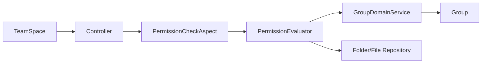
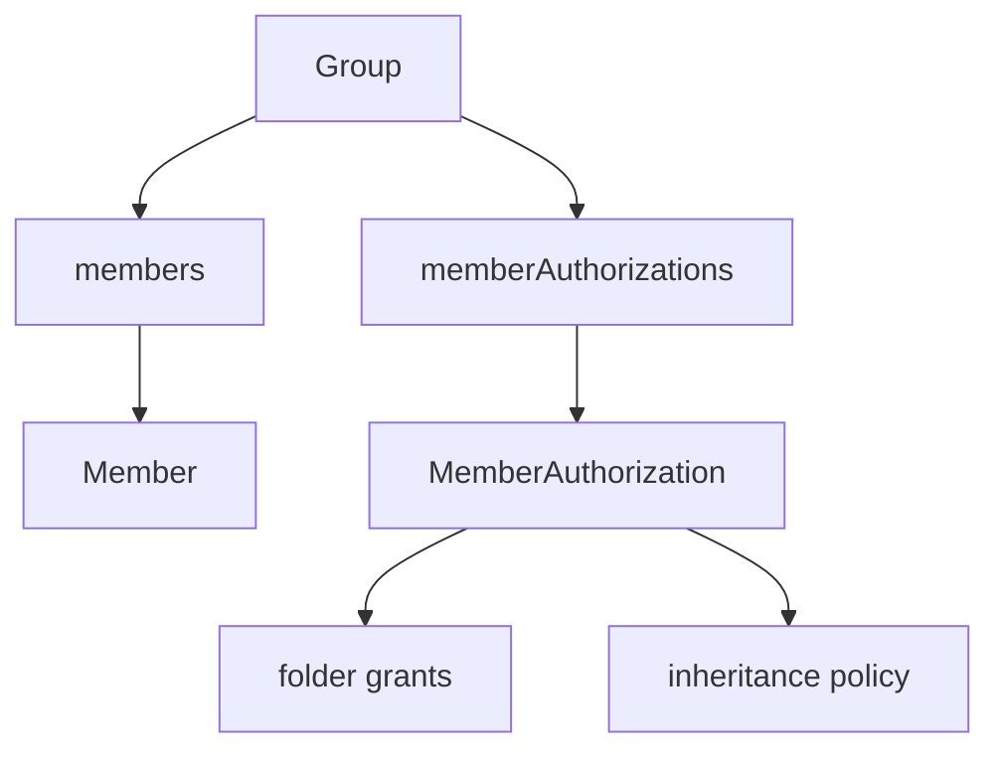
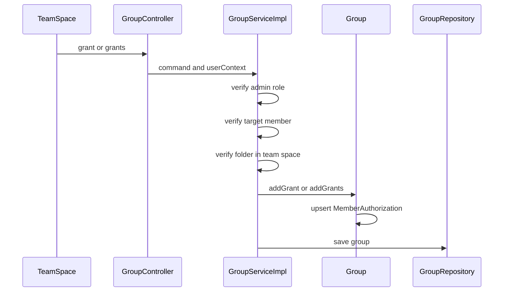
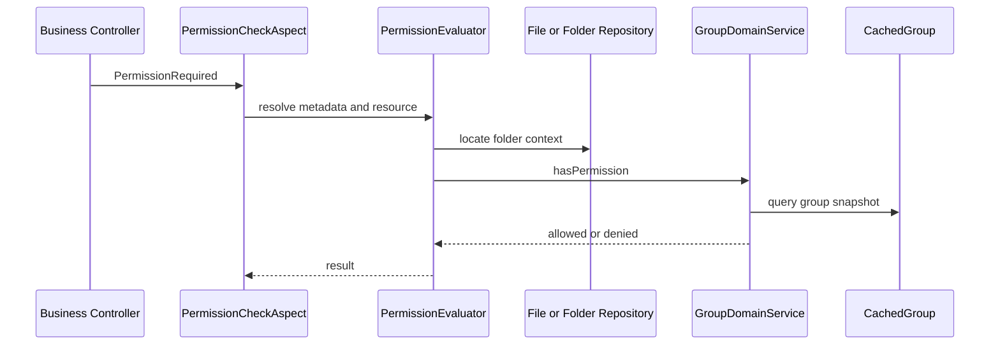

# 权限组设计

## 1. 设计目标

权限组子域用于定义团队空间内的资源访问控制规则。设计目标如下：

- 建立团队级治理边界，使团队管理员与普通成员的职责清晰分离
- 将目录权限建模为成员级授权画像，而非团队共享配置
- 为文件夹、文件、上传与公开发布提供统一且可验证的判权入口
- 使权限求值建立在目录祖先链之上，避免资源侧重复存储权限状态
- 为前端团队空间提供稳定的权限查询读模型

当前方案只面向团队空间。个人空间不通过权限组建模。

---

## 2. 边界与职责

权限组子域位于团队治理与资源访问控制之间，不负责文件内容管理，也不负责目录树结构维护。其职责限定为：

- 维护团队成员及其角色
- 维护普通成员的目录授权画像
- 解析成员在指定目录上的最终权限集合
- 为业务接口提供统一判权能力
- 为团队空间权限可视化提供查询模型

模块职责划分如下：

- `mod-group`
  团队聚合、成员角色、成员授权、权限继承解析、权限查询
- `mod-file-system`
  文件夹与文件资源模型，提供资源定位与归属信息
- `mod-community`
  公共社区发布能力，消费 `PUBLIC` 权限判定结果
- `mod-common`
  `Permission`、`PermissionRequired`、异常模型与切面元数据解析

---

## 3. 领域模型

### 3.1 Group

`Group` 是权限组聚合根，负责承载团队空间访问控制的治理规则。聚合内部包含：

- 团队名称
- 启停状态
- 团队空间标识 `customId`
- 成员列表 `members`
- 成员授权画像列表 `memberAuthorizations`

`Group` 负责以下领域约束：

- 团队内成员角色维护
- 普通成员授权写入
- 管理员与普通成员的授权边界校验
- 团队成员变更时的事件触发

### 3.2 Member

`Member` 仅表达团队成员身份与角色，不表达目录权限。角色定义如下：

- `ADMIN`
- `ORDINARY`

角色属于治理语义，权限属于访问语义。两者分离建模，避免授权规则与组织结构耦合。

### 3.3 MemberAuthorization

`MemberAuthorization` 是普通成员的授权画像，包含：

- 目标成员 `userId`
- 目录到权限集合的映射 `grants`
- 授权继承策略 `inheritancePolicy`

权限组不维护团队共享授权表。每个普通成员拥有独立授权画像，权限判断始终基于成员画像求值。

---

## 4. 角色与授权规则

权限组采用“角色治理 + 成员授权画像”双层模型。

### 4.1 管理员

管理员在团队空间内隐式拥有全部权限。该能力不通过目录授权持久化，而由权限解析过程直接给出全权限集合。

管理员职责包括：

- 管理团队成员
- 管理普通成员的目录权限
- 查看任意普通成员的权限视图

### 4.2 普通成员

普通成员默认无权。普通成员是否具备访问能力，仅取决于管理员为其配置的 `MemberAuthorization`。

普通成员的权限具备以下特征：

- 按成员独立配置
- 按目录独立配置
- 支持独立继承策略
- 不与其他成员共享授权结果

### 4.3 授权边界

写模型必须满足以下约束：

- 授权操作者必须是团队管理员
- 授权目标必须是团队内普通成员
- 授权目录必须属于当前团队空间

以上约束由应用服务与聚合共同保证。

---

## 5. 权限模型

当前权限定义如下：

- `CREATE`
- `READ`
- `WRITE`
- `DELETE`
- `MOVE`
- `PUBLIC`

各权限的业务语义如下：

- `CREATE`
  控制新建文件夹、普通上传、初始化分片上传、完成分片上传
- `READ`
  控制目录读取、文件读取、目录树浏览
- `WRITE`
  控制文件重命名、文件夹重命名及需要写入能力的内容修改
- `DELETE`
  控制文件删除、文件夹删除
- `MOVE`
  控制文件移动、文件夹移动
- `PUBLIC`
  控制文件发布到公共社区

权限模型采用显式能力表达。每个权限对应一组稳定、单义的业务动作。

---

## 6. 继承策略

普通成员的最终权限由目录显式授权与祖先链继承规则共同决定。当前支持四种继承策略：

- `NONE`
  仅当前目录生效
- `FULL`
  父级授权向全部后代目录传播
- `SELECTIVE`
  通过显式目录集合控制传播边界
- `OVERRIDABLE`
  父级授权向下传播，子级可显式覆盖

权限求值基于目录祖先链完成，不扫描整棵子树。求值输入包括：

- 成员授权画像
- 当前目录到根目录的祖先链
- 目标目录的显式授权与继承策略

求值工作由 `PermissionInheritanceResolver` 完成。

---

## 7. 写模型

管理员通过 `GroupController` 发起授权写入。应用服务负责校验操作者身份、目标成员身份与目录归属，聚合负责维护成员授权画像。

写模型的目标不是保存一条授权记录，而是维护成员授权画像的一致性。

---

## 8. 判权模型

业务接口不直接读取授权映射，而统一经过 `@PermissionRequired` 切面。

`PermissionEvaluator` 按资源类型解析判权对象：

- 对文件夹资源，直接在目标文件夹上判权
- 对文件资源，先定位其所属文件夹，再在文件夹上判权

`GroupDomainService` 负责最终权限求值：

- 非团队空间直接放行
- 管理员返回全权限集合
- 普通成员依据授权画像与祖先链计算结果

该设计保证了控制器层不感知团队权限细节，资源判定与权限求值解耦。

---

## 9. 查询模型

权限组查询模型服务于团队空间的管理面板与普通成员权限可视化，提供两类核心查询：

- 团队成员与已授权目录列表
- 指定成员在指定目录上的权限视图

查询规则如下：

- 管理员可查询任意普通成员权限
- 普通成员只能查询自身权限
- 非团队空间返回空权限视图
- 失效目录返回空权限视图
- 管理员权限视图直接返回全权限集合
- 普通成员权限视图返回继承求值后的最终权限集合，并标记是否为继承结果

查询模型不承担权限裁决职责，只负责稳定表达当前判权结果。

---

## 10. 接口落点

权限定义已直接落到具体接口，形成稳定的接口语义映射：

- `FolderController.createFolder`
  需要 `CREATE`
- `FolderController.renameFolder`
  需要 `WRITE`
- `FolderController.deleteFolderForce`
  需要 `DELETE`
- `FolderController.moveFolder`
  需要 `MOVE`
- `FileController.renameFile`
  需要 `WRITE`
- `FileController.deleteFileForce`
  需要 `DELETE`
- `FileController.moveFile`
  需要 `MOVE`
- `FileUploadController.upload`
  需要 `CREATE`
- `FileUploadController.initUpload`
  需要 `CREATE`
- `FileUploadController.completeUpload`
  需要 `CREATE`
- `PublicFileController.post`
  需要 `PUBLIC`

通过这组映射，目录授权可以稳定约束文件系统与公共社区的关键操作。

---

## 11. 与用户模型的协同

团队成员关系不仅保存于 `Group.members`，还必须同步至 `User.groupIds`。这是权限组与用户模型之间的必要协同点。

原因如下：

- 用户侧需要快速识别所属团队
- 部分判权与查询链路依赖用户的团队归属信息

因此：

- 新增成员或管理员时，必须同步写入 `User.groupIds`
- 移除成员或删除团队时，必须同步清理 `User.groupIds`

团队聚合与用户聚合必须保持一致，否则会出现成员已入组但判权结果仍为未入组的错误状态。

---

## 12. 设计约束

当前方案存在以下硬约束：

- 管理员权限为隐式能力，不为管理员建立授权画像
- 目录权限只存在于普通成员授权画像中
- 授权目标必须是团队内普通成员
- 授权目录必须属于当前团队空间
- 判权建立在目录祖先链上，不在文件实体上冗余存储权限
- 用户侧团队归属必须与团队聚合同步

这些约束共同保证读模型、写模型与接口判权结果一致。

---

## 13. 结论

当前权限组方案以 `Group` 聚合为治理核心，以 `MemberAuthorization` 为普通成员访问画像，以 `GroupDomainService` 与 `PermissionEvaluator` 为统一判权入口，形成了完整的团队空间访问控制体系。

该方案具备以下工程特征：

- 角色治理与访问授权分离
- 授权模型稳定落到目录层
- 权限语义与业务动作一一对应
- 写模型、判权模型、查询模型职责清晰
- 前端管理面板与后端判权逻辑保持同一事实来源

这就是项目当前权限组模块的正式设计方案。
