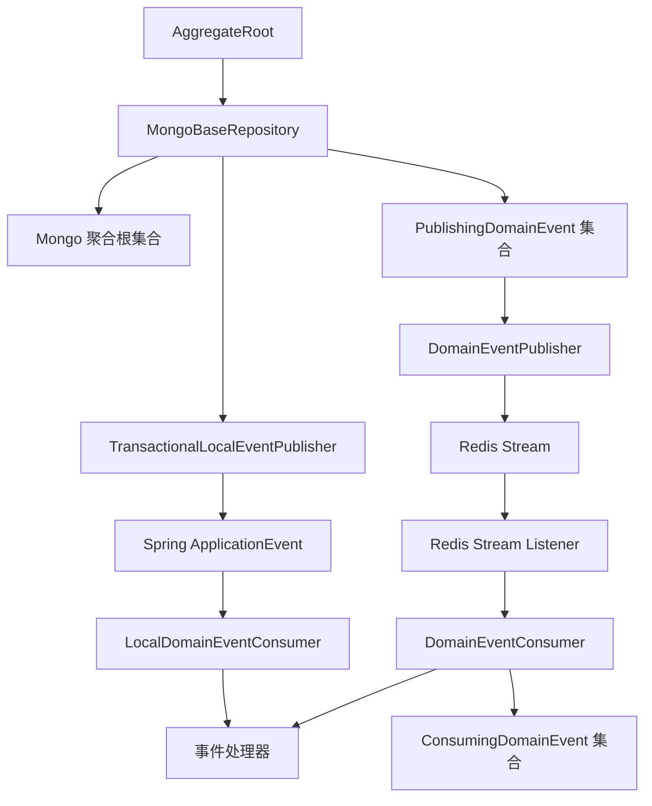
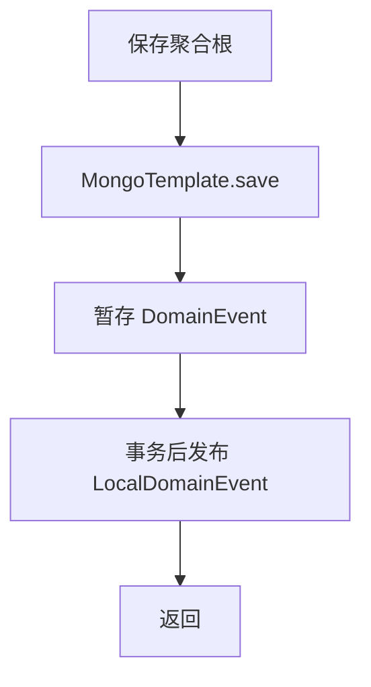
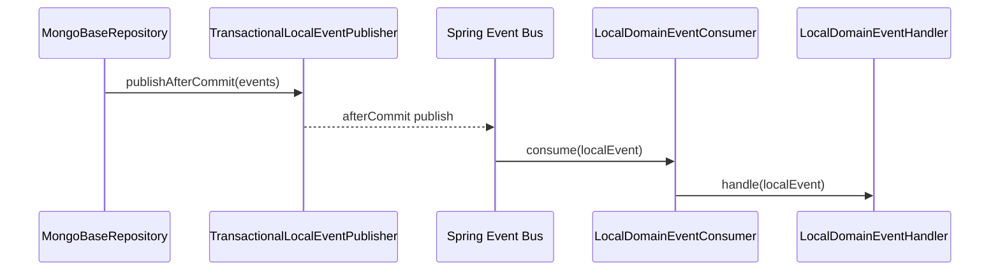
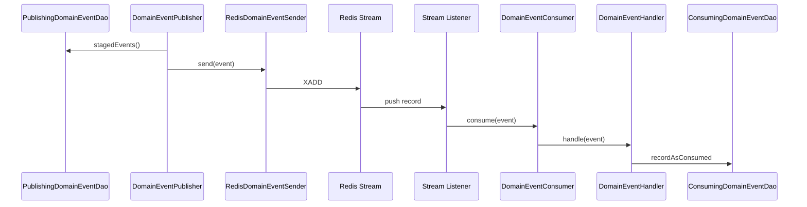

# 领域事件设计

## 1. 范围

本文说明 `mod-common/src/main/java/com/ricky/common/event` 及相关基础设施的设计与约束，重点覆盖以下内容：

- 事件模型划分
- 事件产生、暂存、发布、消费链路
- 幂等与事务边界
- 业务模块接入方式

这套机制服务于整个后端，而不是某一个业务模块。它的职责是为聚合根提供统一的事件出口，并为跨模块副作用提供稳定的执行路径。

---

## 2. 设计判断

系统同时保留两类事件：

- `DomainEvent`：跨模块、跨节点传播的领域事件
- `LocalDomainEvent`：进程内、事务提交后触发的本地事件

这样划分不是为了概念完整，而是因为两类问题的成本结构不同。

`DomainEvent` 解决的是跨边界传播、异步解耦、重试和幂等问题，因此需要持久化、发布状态和消费记录。  
`LocalDomainEvent` 解决的是本模块后处理问题，例如文件上传后的文本提取、摘要生成和索引同步。这类动作不需要经过 Redis Stream，也不应承担分布式投递的复杂度。

---

## 3. 总体结构

结构上有两条独立链路：

1. 聚合根保存后，将 `DomainEvent` 暂存到 Mongo，随后异步发布到 Redis Stream。
2. 聚合根保存后，将 `LocalDomainEvent` 注册到事务回调，在提交后于当前进程内发布。

两条链路共享入口，不共享运行时语义。

---

## 4. 核心对象

### 4.1 `AggregateRoot`

`AggregateRoot` 是事件机制的源头。聚合根内部维护两组瞬时状态：

- `events`
- `localEvents`

并通过以下方法暴露事件出口：

- `raiseEvent(DomainEvent event)`
- `raiseLocalEvent(LocalDomainEvent event)`

这个设计将“状态变化”和“事件声明”放在同一个建模单元内，避免事件拼装散落在 service 层。事件何时保存、何时发布，由 Repository 承接；事件是什么，由聚合根决定。

### 4.2 `DomainEvent`

`DomainEvent` 是分布式领域事件基类，核心字段包括：

- `id`
- `arUserId`
- `arId`
- `type`
- `raisedBy`
- `raisedAt`

约束如下：

- 事件 ID 使用雪花算法生成，满足排序和追踪需要。
- 事件通过 Jackson 多态序列化，供 Redis Stream 传输。
- 事件必须带聚合根上下文，避免处理器依赖额外查询推断来源。

### 4.3 `LocalDomainEvent`

`LocalDomainEvent` 是事务后本地事件。它不承担跨节点传播职责，只用于当前服务内的派生动作。其字段比 `DomainEvent` 更少，重点保留：

- `eventId`
- `aggregateId`
- `userId`
- `occurredAt`

这类事件的价值在于缩短主事务链路，而不是建立另一个消息系统。

### 4.4 `PublishingDomainEvent`

`PublishingDomainEvent` 是分布式事件的发布暂存模型，作用相当于轻量 outbox。关键字段：

- `event`
- `status`
- `publishedCount`
- `raisedAt`

它不负责事件溯源，不做回放语义，只负责可靠投递前的中间态管理。

### 4.5 `ConsumingDomainEvent`

`ConsumingDomainEvent` 用于记录某个事件被某个处理器消费过，核心键为：

- `eventId`
- `handlerName`

这是幂等控制的基础数据，不依赖业务处理器各自建表。

---

## 5. 生产链路

### 5.1 事件声明

业务行为发生在聚合根内，事件也在聚合根内声明。例如：

- `File` 创建时触发 `FileUploadedLocalEvent`
- `CollaborationSession` 创建、加入、离开时触发对应 `DomainEvent`

聚合根表达的是业务事实，不表达消息传输动作。

### 5.2 事件托管

`MongoBaseRepository` 在保存聚合根时统一处理事件：

这个时序有两个关键点：

- 聚合根先落库，再把分布式事件写入 outbox。
- 本地事件不是立即执行，而是挂到事务提交之后。

因此，事件总是从已成功持久化的业务状态出发。

---

## 6. 本地事件链路

### 6.1 发布

`TransactionalLocalEventPublisher` 的规则非常直接：

- 当前存在事务：注册 `afterCommit`
- 当前不存在事务：立即发布

这样设计是为了保证本地后处理不消费未提交数据。

### 6.2 消费

`LocalDomainEventConsumer` 负责将本地事件分发给所有 `LocalDomainEventHandler`。  
本地事件链路不做复杂路由，不做跨节点治理，目标是低开销完成事务后派生动作。

### 6.3 使用场景

目前最典型的场景是文件上传后处理：

- 提取文本
- 生成摘要
- 同步 ES

这些动作与文件创建事实相关，但不应占用上传事务。

---

## 7. 分布式事件链路

### 7.1 暂存

`MongoPublishingDomainEventDao.stage(events)` 将 `DomainEvent` 包装成 `PublishingDomainEvent` 写入 Mongo。  
查询待发布事件时，只抓取以下记录：

- 状态为 `CREATED` 或 `PUBLISH_FAILED`
- `publishedCount < 3`

这是典型的可靠投递而非强一致广播。

### 7.2 发布

`DomainEventPublisher` 按批次扫描待发布事件，并通过 ShedLock 保证同一时刻只有一个节点执行发布任务。  
发布结果分为两类：

- 成功：标记 `PUBLISH_SUCCEED`
- 失败：标记 `PUBLISH_FAILED` 并累计次数

### 7.3 传输

`RedisDomainEventSender` 将事件序列化后写入按用户维度划分的 Redis Stream。  
这种做法不是通用事件总线，而是带业务分流语义的事件通道。

### 7.4 消费

`RedisDomainEventConsumeAutoConfiguration` 为每个 stream 注册监听器，监听器反序列化事件后交给 `DomainEventConsumer`。  
`DomainEventConsumer` 根据处理器泛型和优先级完成分发。

---

## 8. 幂等与事务

### 8.1 幂等

`AbstractDomainEventHandler` 在执行业务逻辑前，先尝试调用 `recordAsConsumed`。  
只有首次消费成功，才进入具体处理逻辑。

这意味着：

- 同一事件被重复投递，不会重复执行业务处理。
- 幂等不是“建议”，而是默认行为。

### 8.2 事务边界

系统采用以下边界划分：

- 聚合根保存与 outbox 暂存同属一个事务
- 本地事件在事务提交后发布
- 分布式事件发送和消费均在事务外进行

这是一种典型的最终一致性设计。系统优先保证写模型正确，再以异步机制接续副作用。

### 8.3 失败语义

当前机制不追求所有副作用强一致，而追求以下特性：

- 失败可见
- 失败可重试
- 重试不重复执行
- 单个处理器失败不阻断其他处理器

这是面向工程运行而不是面向理论完备性的设计。

---

## 9. 业务接入方式

业务模块接入这套机制时，只需要完成两件事：

1. 在聚合根内声明事件
2. 实现对应的处理器

基础设施部分由 `mod-common` 统一提供：

- 事件基类
- 暂存模型
- 发布器
- 消费器
- 幂等记录
- 事务后本地发布器

因此，业务模块不需要重复实现消息投递和幂等逻辑。

---

## 10. 约束与演进方向

当前设计仍有边界：

- `PublishingDomainEvent` 是 outbox，不是事件溯源存储。
- Redis Stream 使用的是当前项目可接受的简化模型，并未引入更重的消息治理机制。
- 本地事件消费状态主要用于运行期跟踪，不是长期审计数据。

后续若系统演进为更强的分布式形态，优先建议补强以下能力：

- 发布失败的告警与运维视图
- 消费失败的补偿入口
- 事件链路监控
- 更细的消费确认与恢复策略

---

## 11. 结论

这套领域事件机制的价值，不在于概念上覆盖了多少术语，而在于它将以下问题沉成了统一基础设施：

- 聚合根如何对外表达业务事实
- 副作用如何从主链路剥离
- 事件如何可靠发布
- 事件如何幂等消费

对项目而言，这是架构级公共能力，而不是某个模块内部的技巧。
